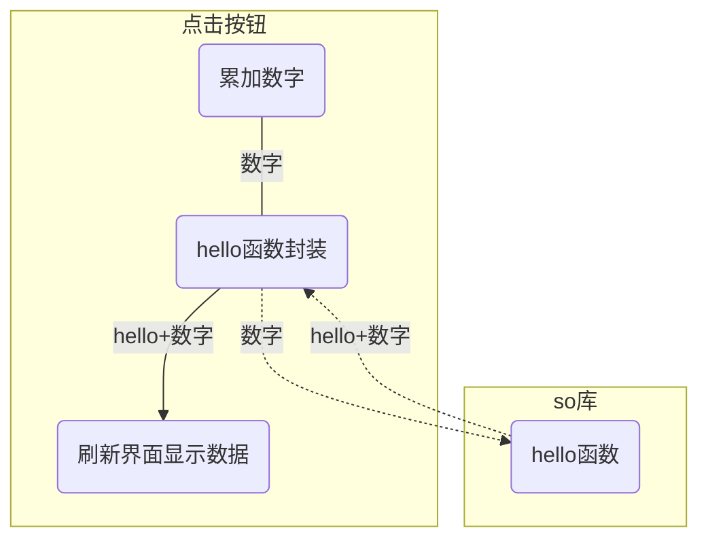

在上一节中我们讲了如何使用NDK编译C/C++项目。编译完成后，我们会拿到so文件以及对应的头文件。在java工程中，我们可以通过jni来调用。而在flutter中，我们可以借助dart调用C/C++代码能力调用它。

好多教程，包括官方教程都是将先包装成一个插件，然后再在flutter里面调用。我们尝试一下直接在flutter工程中调用C/C++。我们改造一下flutter的demo。默认情况下，每次点击`+`号按钮时，dart就是累加计数，并将计数显示出来。我们不仅仅把计数显示出来，还把数字转换成字符串后调用C++的`hello`函数。该函数在数字前加一个“hello ”之后返回。最后，在显示在界面上面出返回的“hello 数字”。




## 调整导出函数

首先，我们通过ndk已经把so库编译好了。但是，编译so库的时候需要注意，dart语言只能调用C类型的导出函数，无法调用C++导出函数。所以，头文件中的导出函数必须带上`extern "C"`。例如：

- hello.h

  ```C
  #ifndef HELLO_H
  #define HELLO_H
  extern "C" {
  
  const char* hello(const char* msg);
  
  }
  #endif
  ```

  其中，第3和7行是必不可少的。没有了这两行，编译出来的库无法在flutter中直接使用。

## 调用导出函数

### 创建工程

我们创建一个demo功能。

```bash
flutter create demo
```

### 引入so

1. 将so加入到功能中。

```
cd demo
mkdir -p android/app/src/main/libs/arm64-v8a
cp libhello.so android/app/src/main/libs/arm64-v8a
```

如果需要`armeabi-v7a`、`x86`或者其他硬件类型的也如法炮制即可。

2. 配置build.gradle

文件路径：`android/app/build.gradle`

```bash
    sourceSets {
        main.java.srcDirs += 'src/main/kotlin'
        main.jniLibs.srcDirs 'src/main/libs'
    }
    ......
    buildTypes {
        release {
            // TODO: Add your own signing config for the release build.
            // Signing with the debug keys for now, so `flutter run --release` works.
            signingConfig signingConfigs.debug 
           ndk {
               abiFilters 'arm64-v8a'//,'armeabi-v7a','armeabi','x86'
           }
        }
        debug { 
           ndk {
               abiFilters 'arm64-v8a'//,'armeabi-v7a','armeabi','x86'
           }
        }
    }
```

其中，第3、11~19行是新增。第3行的含义是告诉编译器so库的位置，编译打包时会把这些文件打包到apk的lib目录下面。

第11~19行是告诉编译器，我们只需要`arm64-v8a`这一个硬件平台。如果你需要更多，可以自己调整。

### 封装调用

新增一个调用类，对C/C++库进行一个调用封装，以方便使用。

创建文件：`lib/native_hello.dart`

```dart
import 'dart:ffi';
import 'dart:io';
import 'package:ffi/ffi.dart';

typedef Hello = Pointer<Utf8> Function(Pointer<Utf8> str);

class HelloNative {
  final DynamicLibrary dylib = DynamicLibrary.open("libhello.so");
  late Hello fnHello;
  HelloNative() {
    fnHello = dylib.lookupFunction<Hello, Hello>('hello');
  }

  String hello(String msg) {
    final msgUtf8 = msg.toNativeUtf8();
    final ret = fnHello(msgUtf8).toDartString();

    calloc.free(msgUtf8);

    return ret;
  }
}
```

其中：

- 第1行：我们引入了ffi这个包，它提供了dart调用C/C++的能力。

- 第3行：dart内置的ffi包中没有Utf8类型，为了处理字符串，我们还没有引入`ffi/ffi.dart'`。

- 第5行：定义了一个函数类型。跟C/C++中的比较相像，不同的是数据类型。ffi对两种语言的各种数据类型都做映射封装，具体如下：

  | C/C++类型 | dart类型                                                     | 说明                                                         |
  | --------- | ------------------------------------------------------------ | ------------------------------------------------------------ |
  | bool      | [Bool](https://api.dart.cn/stable/dart-ffi/Bool-class.html)  |                                                              |
  | double    | [Double](https://api.dart.cn/stable/dart-ffi/Double-class.html) |                                                              |
  | float     | [Float](https://api.dart.cn/stable/dart-ffi/Float-class.html) |                                                              |
  | int8      | [Int8](https://api.dart.cn/stable/dart-ffi/Int8-class.html)  |                                                              |
  | int16     | [Int16](https://api.dart.cn/stable/dart-ffi/Int16-class.html) |                                                              |
  | int32     | [Int32](https://api.dart.cn/stable/dart-ffi/Int32-class.html) |                                                              |
  | int64     | [Int64](https://api.dart.cn/stable/dart-ffi/Int64-class.html) |                                                              |
  | 函数指针  | [NativeFunction](https://api.dart.cn/stable/dart-ffi/NativeFunction-class.html) | 函数指针类型。<br>不过，需要注意的是在dart中无法定义一个函数指针类型。<br>这也就导致了无法在C/C++中调用dart的函数。 |
  | ？？      | [Opaque](https://api.dart.cn/stable/dart-ffi/Opaque-class.html) | 不清楚在C/C++中是啥。官方文档中也是语焉不详。                |
  | uint8     | [Uint8](https://api.dart.cn/stable/dart-ffi/Uint8-class.html) |                                                              |
  | uint16    | [Uint16](https://api.dart.cn/stable/dart-ffi/Uint16-class.html) |                                                              |
  | uint32    | [Uint32](https://api.dart.cn/stable/dart-ffi/Uint32-class.html) |                                                              |
  | uint64    | [Uint64](https://api.dart.cn/stable/dart-ffi/Uint64-class.html) |                                                              |
  | void      | [Void](https://api.dart.cn/stable/dart-ffi/Void-class.html)  |                                                              |
  | 指针      | [Pointer](https://api.dart.cn/stable/dart-ffi/Pointer-class.html) | 指针类型。Pointer是个模板类<br>`Pointer<Int8>`指的就是`int8 *`，其他类型也一样。 |
  | 数组      | [Array](https://api.dart.cn/stable/dart-ffi/Array-class.html) | 数组类型。跟Pointer一样，Array也是个模板类<br>`Array<Int8>(10)`就是`int8 xxx[10]`<br>`Array<Int8>(10, 20)`就是`int8 xxx[10][20]`<br>…… |

  对于字符串类型，这比较特别。在C/C++中，字符串就是以\0结尾的内存块。但是在dart中，字符串是个类。所以，我们需要使用String类型的`toNativeUtf8`方法得到这个内存块。然后，借助ffi的模板类Pointer对类型进行转换包装。不过，需要留意的是`toNativeUtf8`方法返回的内存块是需要手动释放的。

  另外，除了基本类型还对结构体、联合体和数组进行了类型转换封装。关于这三种，我们后面讨论。

3. 第8行，是加载动态库。需要注意的是，我们不需要在这儿判断硬件类型。我们前面已经把不同类型的so放在了不同的目录里面了。dart运行时会处理这部分逻辑。
4. 第11行，就是从so库中找到对应的导出函数，并获得其函数指针。其实，lookupFunction这个模板函数是支持两个函数类型的，一个是C函数类型，另一个是dart函数类型。
5. 第14~21行则是实际调用方法。

最后，改一下`MyHomePage`，调用`函数hello`，并将返回值显示在界面上，代码如下：

```dart
class MyHomePage extends StatefulWidget {
  const MyHomePage({Key? key, required this.title}) : super(key: key);

  final String title;

  @override
  State<MyHomePage> createState() => _MyHomePageState();
}

class _MyHomePageState extends State<MyHomePage> {
  int _counter = 0;
  final _hello = HelloNative();
  String msg = "";

  void _incrementCounter() {
    setState(() {
      _counter++;
      msg = _hello.hello(_counter.toString());
    });
  }

  @override
  Widget build(BuildContext context) {
    return Scaffold(
      appBar: AppBar(
        title: Text(widget.title),
      ),
      body: Center(
        child: Column(
          mainAxisAlignment: MainAxisAlignment.center,
          children: <Widget>[
            Text(msg),
            Text(
              '$_counter',
              style: Theme.of(context).textTheme.headline4,
            ),
          ],
        ),
      ),
      floatingActionButton: FloatingActionButton(
        onPressed: _incrementCounter,
        tooltip: 'Increment',
        child: const Icon(Icons.add),
      ),
    );
  }
}
```

## 运行效果


需要注意的是因为例子仅仅支持了`arm64-v8a`这种硬件，所以，无法在x86的模拟器中运行。如果你运行失败，最好是在真机中试一下。